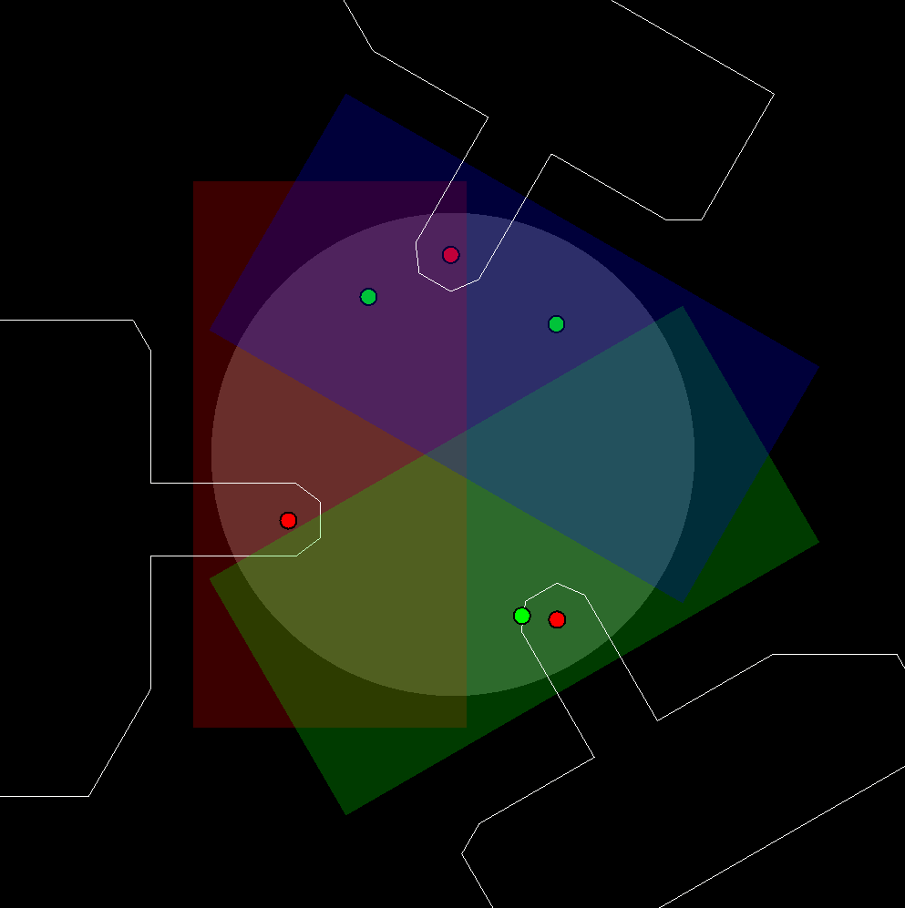

# Asterism validator (and simulator)

Given XY coordinates of 3 Natural Guide Stars the program can establish if they are reachable by the LOR boards.

The program also simulates the movement of the LOR boards to reach the NGSs.

Libraries used are:
* CGAL (Computational Geometry Algorithms Library)
* SFML for graphic rendering
* sciplot for plotting histograms of dataset simulations

The program can be normally built with ```cmake``` and ```make```.

Example of graphical output:


Example of main: 
```c++
int main () {
    Simulation_manager::simulate_dataset(Movement::linear_trajectory, cedric_dataset);

    Graphic_viewer gv;
    gv.animate(Movement::linear_trajectory, cedric_dataset[0], cedric_dataset[1]);

    return 0;
}
```

Example of command line output:
```
Simulation from point 73 to point 74 failed.

======================================================================================
                                Simulation results                                    

> Movement type			linear trajectory
> Start asterism		{-161.017300, -175.675520, 26.121872, 149.281560, 53.297924, -243.279530}
> Start valid			true
> Destination asterism          {164.464720, -146.879780, -97.516890, 61.492350, 187.146640, -238.569890}
> Destination valid		true

> Boards cruise velocity	10.000000 mm/s
> Movement duration		2.500000 seconds
> Simulation iterations		50
> Max iterations exceeded	false
> Iteration time step		0.050000 seconds
> Iteration distance step	0.500000 mm
> Destination reached		false
> Distance from dest		inf
> Collision detected		true
> FoV small vignetting		false
> FoV large vignetting		false
======================================================================================

======================================================================================
                             Dataset simulations results                              

> Movement type 	linear trajectory
> Boards cruise vel 	10.000000 mm/s
> Total sims		333
> Successful sims	331
> Avg duration		26.694864 s
======================================================================================
```

