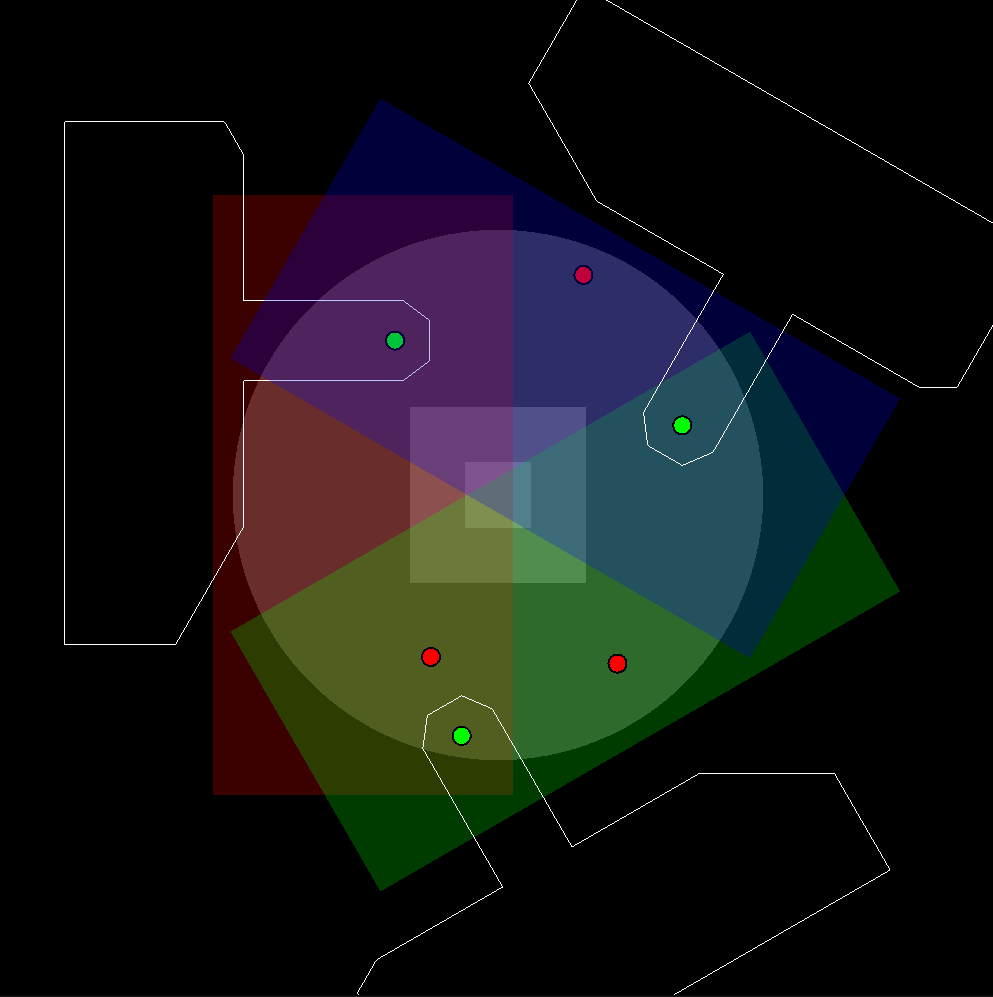
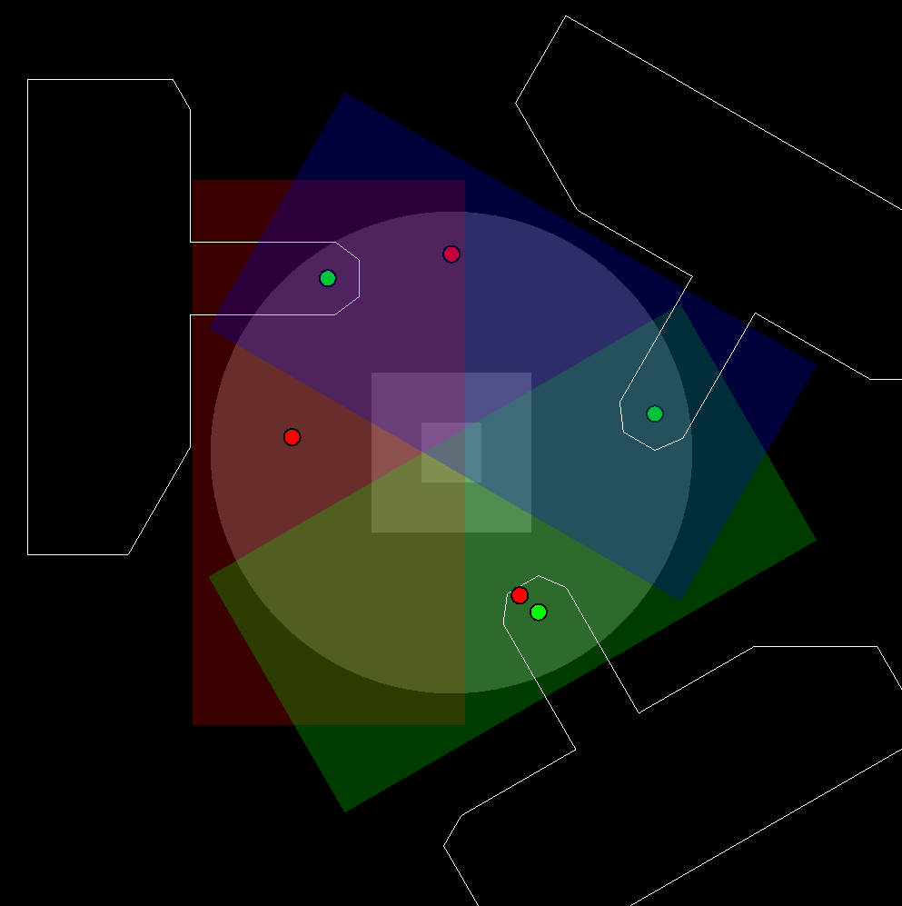
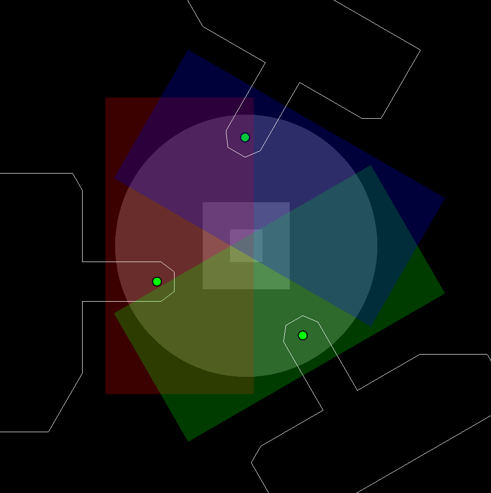
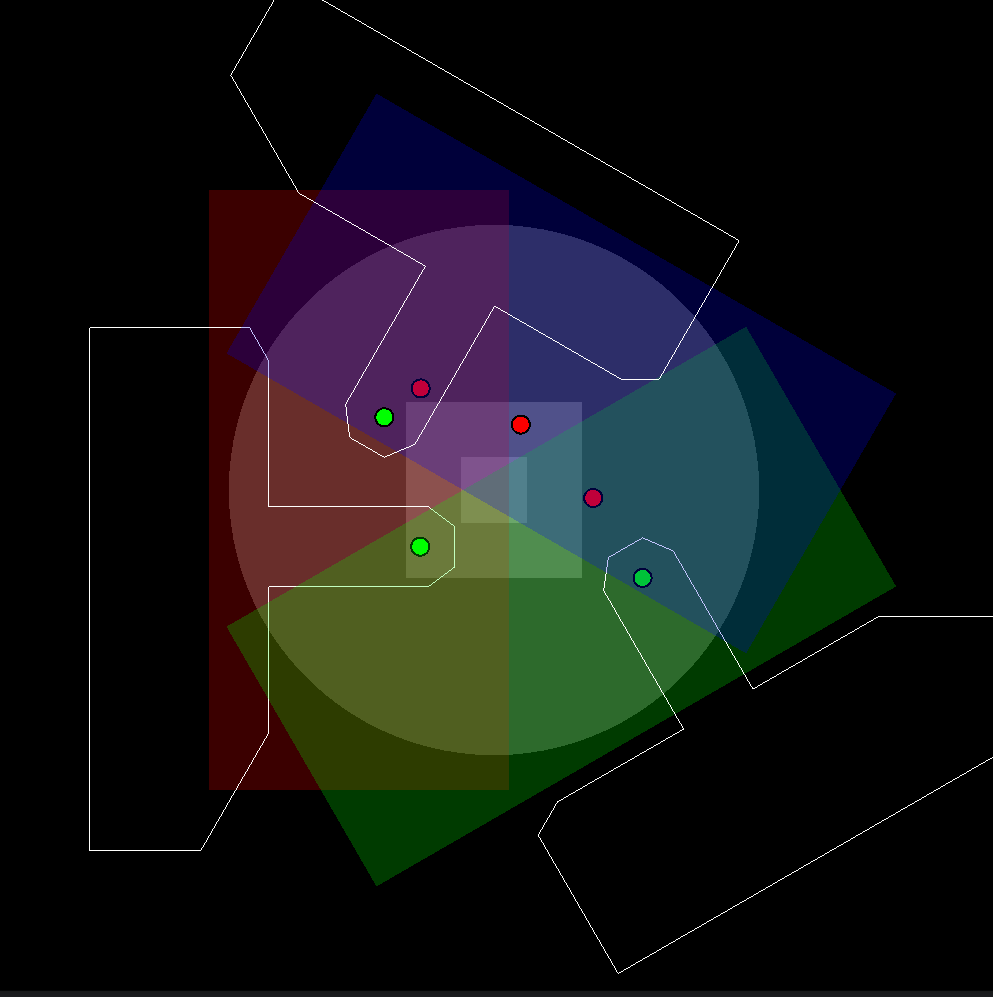
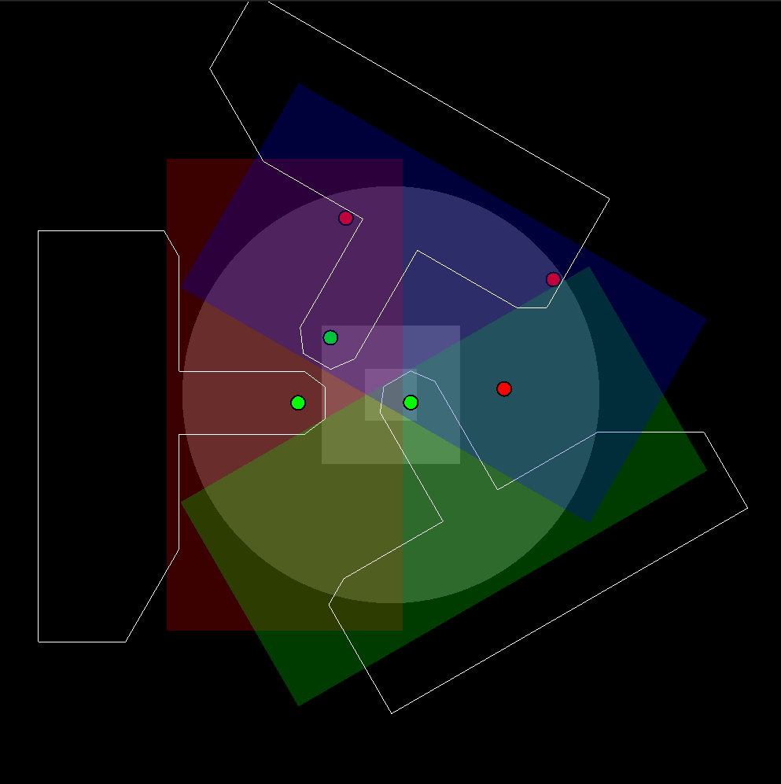
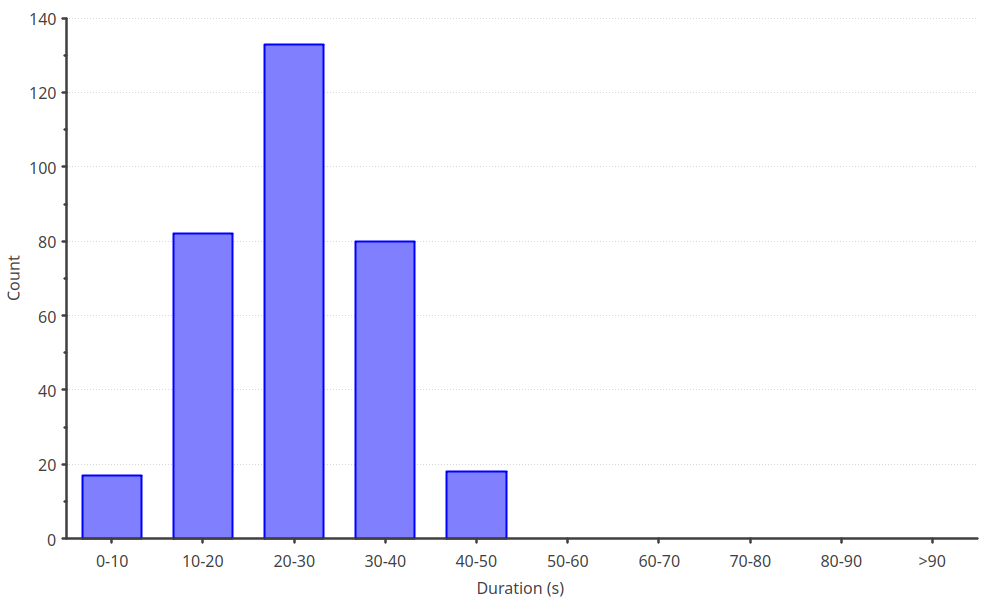

# Asterism validator

Given the coordinates of an asterism the program can establish if it's valid, i.e. if it's reachable by the LOR boards.

Given a start asterism and a destination asterism, the program simulates various movements that can be performed by the LOR boards:
* ***Linear movement*** from start asterism to destination asterism
* ***Safe-basic movement*** from start asterism to destination asterism
* ***Outside-technical-field movement*** from start asterism

The program detects if a collision between the boards occurs at any moment during the movements.

The program can also ***generate collision-free trajectories*** for the boards with A-star search algorithm. Trajectories generated with A-star can also selectively avoid the scientific FoVs.

Examples of these and other features are shown below.

Libraries used are:
* CGAL (Computational Geometry Algorithms Library)
* SFML for graphic rendering
* sciplot for plotting histograms of dataset simulations

The program can be normally built with ```cmake``` and ```make```.
<br>
<br>

#### Example of linear movement:


#### Example of safe-basic movement:


#### Example of outside-technical-field movement:


#### Example of A* collision-free trajectories:



#### Example of main:
```c++
int main () {
    Simulation_manager::simulate_dataset(Movement::linear_trajectory, cedric_dataset);

    Graphic_viewer gv;
    gv.animate(Movement::linear_trajectory, cedric_dataset[0], cedric_dataset[1]);

    return 0;
}
```

#### Example of command line output:
```c++
Simulation from asterism 73 to asterism 74 of the dataset failed. Detailed info below: 
---------------------------------------------------------------------------------------------------------
> Movement type				linear
> Start asterism			{-161.017300, -175.675520, 26.121872, 149.281560, 53.297924, -243.279530}
> Start valid				true
> Destination asterism		{164.464720, -146.879780, -97.516890, 61.492350, 187.146640, -238.569890}
> Destination valid			true

> Boards cruise velocity	10.000000 mm/s
> Movement duration			2.500000 s
> Simulation iterations		50
> Max iterations exceeded	false
> Simulation time step		0.050000 s
> Destination reached		false
> Distance from dest		522.753086 mm
> Collision detected		true
> FoV small vignetting		false
> FoV large vignetting		false
---------------------------------------------------------------------------------------------------------


/////////////////////////////////////////////////////////////////////////////////////////////////////////
                                      Dataset simulations results                                       

> Movement type				A star
> Boards cruise velocity	4.000000 mm/s
> Dataset size				3696 asterisms
> Total simulations			3695
> Successful simulations	3695
> Success rate				100.000000 %
> Avg successful duration	56.333112 s
/////////////////////////////////////////////////////////////////////////////////////////////////////////
```

#### Example of histogram output:
